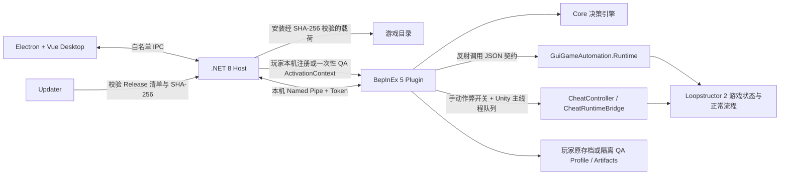

# 架构

## 设计目标

AutoPlayer 把“桌面呈现”“控制编排”和“游戏内执行”分开：Electron + Vue Desktop 负责统一可见界面，.NET 8 Host 掌握安装、进程连接、更新和本机 IPC；BepInEx 插件只接受当前 Windows 用户下、绑定游戏目录和程序集指纹的本机授权。玩家常驻模式允许手动启动游戏后随时连接，隔离 QA 模式继续使用单次授权与独立测试数据。`0.6.51` 暂停开放自动游玩启动入口，但保留 Core 与 Plugin 实现，并允许停止升级前遗留的运行会话。

工具不携带游戏 DLL，也不修改 `Assembly-CSharp.dll`。插件通过反射发现打包游戏中已有的 `GuiGameAutomation.Runtime` 类型，因此游戏更新后可以先完成指纹和契约检查，再决定是否运行。



## 组件职责

| 组件 | 目标框架 | 职责 |
|---|---|---|
| `Loopstructor.AutoPlayer.Launcher` | .NET 8 NativeAOT 自包含单文件 | 位于发布根目录，原样转发参数并启动内部 Manager 后立即退出 |
| `desktop` / `Loopstructor.AutoPlayer.Manager.exe` | Electron 44、Vue 3、TypeScript、Vite、Pinia、Tailwind CSS | 单实例统一窗口、路由、响应式布局、目录呈现、Tooltip、Toast、模态窗和严格 IPC 白名单；renderer 开启 sandbox/contextIsolation 且不具有 Node 能力 |
| `Loopstructor.AutoPlayer.Host` | .NET 8 Windows 自包含 | 无窗口 JSON 行 RPC Host；负责游戏验证、插件安装、可信会话、命名管道、作弊命令、设置、日志和更新交接 |
| `Loopstructor.AutoPlayer.Updater` | .NET 8 Windows WPF 自包含 | 在 Electron 与 Host 退出后从临时副本校验并替换工具文件，避免运行中的文件被覆盖 |
| `Loopstructor.AutoPlayer.Core` | `netstandard2.0` | IPC 数据模型、协议版本、构建/会话标识和可单元测试的游玩决策 |
| `Loopstructor.AutoPlayer.Plugin` | `netstandard2.1` | BepInEx 生命周期、激活校验、兼容性检查、隔离补丁、Named Pipe 服务、作弊调试桥接、证据采集 |
| `GuiGameAutomation.Runtime` | 游戏构建 | 暴露查询和动作命令；属于 Loopstructor2 源码与最终游戏构建，不属于本仓库发布物 |

## 启动与激活

1. 根 Launcher 启动 Electron Desktop；Electron 启动 .NET Host，并通过逐行 JSON RPC 取得状态。renderer 只能调用 preload 暴露的类型化白名单。
2. Host 定位游戏 EXE，并读取 `<Game>_Data\Managed\Assembly-CSharp.dll` 的 SHA-256。
3. 安装或验证插件后，Host 为该游戏根目录写入当前 Windows 用户专用的 `control\installed-<root-id>.json`。其中的稳定 pipe、随机高熵 token、根目录哈希、程序集指纹和工具拥有的数据目录构成玩家模式本机注册。
4. 玩家可以手动启动游戏，也可以由统一桌面窗口启动。游戏已运行时 Host 只连接现有进程；插件读取本机注册后进入 `ResidentPlayer` 待命，不会自动开始操作。
5. 隔离 QA 模式使用另一条路径：每次启动生成新 pipe 和 token，通过子进程环境变量或最长 10 分钟的单次票据传递 QA profile、artifact 与预期程序集哈希；票据读取后立即删除。
6. BepInEx 加载插件后，`ActivationContext` 验证协议、游戏根目录、pipe、token、工具拥有的数据目录和预期程序集哈希，再启动一个隐藏且独立于 BepInEx 管理对象的运行时根对象。BepInEx 启动组件随后被游戏清理也不会关闭控制通道；独立宿主若在场景切换中消失，静态会话通过场景和渲染前回调在主线程重建它。玩家注册还必须匹配固定文件位置与根目录哈希；单次票据还必须验证有效期。
7. 插件重新计算实际程序集指纹，检查产品身份和 `GuiGameAutomation.Runtime` 必需方法集合。失败时不安装操作补丁，也不接受控制。
8. `ResidentPlayer` 明确不安装 QA 存档重定向、平台写入阻断或游戏诊断产物重定向；任一标志意外为 true 时 Host 拒绝握手。玩家原存档和平台行为保持游戏默认语义。
9. `IsolatedQa` 安装 QA 存档路径补丁，并通过运行中的 `SaveManager.GetSaveFolderPath` 验证实际路径位于本次 profile；随后安装四个必需的平台写入/重启补丁和诊断产物重定向。四项隔离状态必须全部为 true。
10. 插件在 `hello` 中回传自身真实 PID、随机进程实例标识、激活模式、指纹、运行时契约和隔离状态。Host 只在该 PID 仍存活、启动时间未变化、可执行文件路径等于所选游戏且模式门禁相符时接受握手；后续每条请求都必须继续匹配 PID 与进程实例标识。
11. 连接成功后插件保持 Standby。`0.6.51` 的自动游玩页不发送 `start`；作弊能力随可信会话提供，并在统一窗口顶部控制条中显式开启。

支持的环境变量由共享协议定义：

```text
LOOPSTRUCTOR_AUTOPLAYER_ENABLED=1
LOOPSTRUCTOR_AUTOPLAYER_PIPE=<per-launch-name>
LOOPSTRUCTOR_AUTOPLAYER_TOKEN=<per-launch-secret>
LOOPSTRUCTOR_AUTOPLAYER_PROFILE_ROOT=<absolute-qa-profile-path>
LOOPSTRUCTOR_AUTOPLAYER_ARTIFACT_ROOT=<absolute-artifact-path>
LOOPSTRUCTOR_AUTOPLAYER_ASSEMBLY_SHA256=<64-lowercase-hex>
LOOPSTRUCTOR_AUTOPLAYER_CHEAT_ALLOWED=1  # 可信 Manager 会话固定提供能力，仍需手动开启
```

这些变量只属于隔离 QA 启动协议，不是建议用户手工配置的永久设置。profile 必须位于 `DataRoot\profiles` 的子目录，artifact 必须位于 `DataRoot\artifacts` 的子目录。玩家模式不注入这些变量，而是读取当前用户的本机注册。

`SteamAppId=3841840` 与 `SteamGameId=3841840` 也是进程级启动参数，但不属于自动化认证协议。它们只用于固定所选 QA 构建的 Steam 开发启动语义，不会写入游戏目录或永久环境。

## IPC 协议

IPC 使用本机 Named Pipe，每个连接传输一个 UTF-8 JSON 请求和响应。玩家模式对同一已安装游戏保存稳定的 pipe 基础名与 token，插件按当前 PID 派生进程专属端点；Manager 没有既有绑定且发现多个同目录游戏进程时拒绝任意选择。隔离 QA 模式每次启动重新生成端点与 token。协议 v3 的每个请求都携带请求 ID、对应 token、目标 PID；`hello` 返回随机进程实例标识，后续请求还必须携带并匹配该标识：

```json
{"id":"request-1","token":"<session-token>","command":"status"}
```

基础命令如下：

| 命令 | 行为 |
|---|---|
| `ping` | 检查 pipe 与协议是否可用 |
| `status` | 返回状态、兼容性门禁、隔离状态和最近时间线 |
| `start` | 使用本次运行选项开始自动游玩 |
| `pause` | 在当前状态暂停决策，不终止游戏 |
| `resume` | 恢复决策循环 |
| `stop` | 回到待机状态，不再调用游戏动作 |

控制服务最多维持四个并发监听，半开连接的首行读取和响应写入都有明确期限，并且启动时至少等待一个监听器成功绑定后才报告插件激活。改变 Unity 状态的命令仍排队到游戏主线程执行，不能从 pipe 线程直接操作 Unity 对象；主线程命令超过等待窗口时返回“仍在执行”并释放监听，但 pending 请求和结果缓存继续保留。Manager 在总期限内用同一请求 ID 轮询最终结果，超出期限的写操作按结果未知处理并冻结继续写入，不会用新 ID 自动重试。

作弊协议在基础命令之外使用独立版本号和固定命令集：

| 命令 | 行为 |
|---|---|
| `cheat.setEnabled` | 在已授权会话中手动开启或关闭作弊模式 |
| `cheat.queryCatalog` / `cheat.queryState` | 查询目录格式 v5 的战车、附魔、消耗品、弹射点、遗物、普通敌人及作弊状态；战车、附魔、道具和遗物来自当前游戏程序集的完整枚举，项目带类型/家族/等级排序字段、简体中文名、枚举名、图标引用和游戏原始说明 |
| `cheat.grantVehicle` | 获取战车，并可传入多组附魔和各自等级 |
| `cheat.removeVehicle` | 按稳定运行时战车 ID 删除指定已有战车 |
| `cheat.grantDisposable` | 获取指定消耗品 |
| `cheat.clearConsumables` / `cheat.clearBackpackCatapultPoints` | 按运行时行为分类后，分别清空非弹射点消耗品或背包中的普通、能量与特殊弹射点 |
| `cheat.grantCatapultPoint` | 获取配置中直接创建普通、能量或特殊站点的可放置弹射点，并同步背包状态 |
| `cheat.removeCatapultPoint` | 删除背包中的指定弹射点 |
| `cheat.removeFieldCatapultPoint` / `cheat.clearFieldCatapultPoints` | 单删或清空场上弹射点，并通过游戏正式销毁链清理关联状态且阻止回收到背包 |
| `cheat.setFieldCatapultDeleteMode` | 开启游戏内精确碰撞命中的左键场上弹射点删除；空白和 UI 点击不误删，Esc 退出 |
| `cheat.setBaseGodMode` | 开启或关闭基地无敌 |
| `cheat.endWave` | 结束当前允许结束的普通波次 |
| `cheat.clearEnemies` | 清除当前已生成的敌人，不清空后续生成计划 |
| `cheat.queryVehicles` / `cheat.modifyVehicle` | 查询运行时车辆 ID 与现有附魔，并用中文属性名选择、内部属性 ID 写入指定车辆属性 |
| `cheat.setVehicleEnchantment` | 设置已有战车的一项附魔等级；等级为 `0` 时移除该附魔，同时保留其他附魔 |
| `cheat.removeAllRelics` | 与一键补齐互斥地逐帧删除全部已持有遗物，并报告进度及失败项 |
| `cheat.queryEnemies` / `cheat.modifyEnemy` | 查询运行时敌人 ID，并用中文属性名选择、内部属性 ID 写入指定敌人属性 |
| `cheat.setEnemyIdOverlay` | 在游戏画面中显示或隐藏敌人 ID |
| `cheat.grantRelic` | 获得指定遗物 |
| `cheat.grantAllRelics` | 逐帧补齐全部尚未持有的已配置遗物，并报告进度与单项失败 |
| `cheat.removeRelic` | 删除指定枚举的已有遗物并撤销其正式运行时效果 |
| `cheat.setSpawnPointCapture` | 开启或取消左 Alt 加鼠标左键的位置捕获；每次捕获向点位列表追加一个点 |
| `cheat.removeSpawnPoint` / `cheat.clearSpawnPoints` | 单删或清空当前场景保存的怪物生成点 |
| `cheat.spawnEnemy` | 在一个或多个坐标周围分散生成普通敌人；默认使用当前波次 AI 等级 |
| `cheat.setMapSkipEnabled` | 开启或关闭当前进度之后节点的自由跳转 |

可信会话开启作弊能力后仍可执行 `start`。自动游玩运行或暂停期间，插件只放行启用/关闭作弊、目录与实体查询，以及敌人 ID/Buff 覆盖层；这些覆盖层不创建持久作弊标记，其余作弊写命令失效即关闭。基地无敌或地图跳关仍开启时拒绝开始自动游玩。获准的写命令进入游戏 API 前必须先在当前自动游玩配置创建持久作弊标记；无法确认标记已落盘时命令失效即关闭。写尝试会设置 `CheatUsed` 并把后续运行完整性标记为 `cheat-modified`；只有真正的自动化故障或不确定部分写入才设置 `NeedsProcessRestart`。请求 ID 用于同一写请求的幂等重取：重复 ID 但参数不同会被拒绝，已在主线程开始的请求会返回其实际完成结果。

Manager 持续向插件提供控制租约。场景切换会重置基地无敌、敌人 ID 覆盖层、待捕获位置、已保存生成点、场上弹射点点击删除和地图跳关；Manager 断连或心跳超时会进一步关闭作弊模式和全部瞬态功能。位置捕获与点击删除通过 Harmony 接入 `DefaultInputHandler.Update` 的本帧输入快照，在游戏 UI、物体和玩法交互读取该次输入前检查按键、UI 命中及对象碰撞；成功后调用游戏自身的 `UseInputOnly()` 消费点击。`OnGUI` 为生成点绘制编号十字，为点击删除目标绘制红色删除标记。补丁未安装时两种功能拒绝开启，不回退到未排序的 BepInEx `Update`。

Manager 的作弊选择器在获得焦点后保持结果列表打开，目录项同时携带中文名、枚举名、稳定 ID、家族排序和图标，可按任一文本字段搜索；协议仍只发送确认选择后的稳定 ID。战车按去掉 `_L#` 后的家族及等级排列，附魔按基础家族与 `Train/Railway/Domain` 变体排列。“获取战车”的常驻附魔网格以左键饱和递增至 `int.MaxValue`、右键递减至 `0` 并移除，不设置种类或层数产品上限。属性显示名优先从游戏的简体中文属性配置解析，配置缺项时使用与 `BattleMemoryEnum` 逐项精确对应的中文表兜底。已有战车附魔编辑先读取完整附魔列表，再通过游戏车辆管理器重建附魔并刷新车辆状态；等级 `0` 表示移除目标项，不清除其他附魔。作弊开启时 Harmony 只接管受限战车卡片的附魔图标布局，取消“更多”占位并紧凑换行；详情面板保持原尺寸，关闭作弊后恢复原布局。

地图跳关补丁使用 `RoomMapUI.path` 最后一个节点作为当前进度层，与游戏原生 `UpdateCurrentLayer` 一样隐藏当前层及历史层，只临时开放进度之后的节点。它在没有活动波次、没有运行节点、没有待选子关卡且游戏未结束时，按游戏原有流程加载目标的最小前置路径、重新取得目标节点、调用节点点击并请求保存；陈旧阶段请求、跨阶段和失效节点都会拒绝。跳转前会保存原阶段和路径，后续校验或调用失败时执行补偿恢复，恢复失败则自动关闭地图跳关。批量刷怪先读取 `WaveProgressController.CurrentAILevel`，与正式 `WaveNest` 一样把该内部等级传给 `AgentCreator.CreateAgent`，因此继续经过 `AITable.InitTable`、`BasicAIDataSO.GetBasicParameters`、全局难度及无尽倍率；只有显式自定义时才用 UI 等级减一覆盖。每个生成点在 `spawnRadius` 内产生带最小间距的坐标，再逐个确认对象已进入敌方阵营、具备启用的敌方碰撞层、战斗系统和可受击状态；验证失败的对象会通过游戏回收接口清理。

## 游戏运行时契约

`RuntimeBridge` 不引用 `Assembly-CSharp.dll`，而是在已加载程序集里按完整类型名查找 `public static` 方法。当前契约覆盖：

- 前端、普通模式与随机模式选择；
- 当前可执行动作、奖励、事件、商店和弹窗；
- 默认防御、车辆、地图、子关卡、时间倍率和开波。

所有方法使用 JSON 字符串作为输入和结构化 JSON 作为输出。任何必需类型或方法缺失都会记录在握手状态中，整套自动化视为不兼容；不能只运行“碰巧还能找到”的部分命令。自动玩家不移动系统鼠标，也不发送系统键盘事件，因而不会抢占人工操作所依赖的全局输入；真实输入链路需要由独立黑盒测试覆盖。

`CheatRuntimeBridge` 同样不静态引用游戏程序集，而是按当前受支持构建的实际类型与方法签名反射调用车辆、物品、波次、敌人和属性系统。目录查询在 Unity 主线程读取官方配置，用显式 `zh` Locale 解析名称，并将不可读图集中的 Sprite 裁剪为按内容哈希命名的 PNG 写入本次 artifact；IPC 只传相对路径和 SHA-256。写命令先验证授权、与激活模式一致的安全门禁、作弊开关、对象运行时 ID 和参数范围：玩家模式要求 QA 隔离补丁全部未启用，隔离 QA 模式要求它们全部通过。运行时类型、方法、配置预制体或对象身份不符合预期时拒绝动作。

## 决策循环

Core 中的 `DecisionEngine` 不直接访问 Unity。插件先查询状态，再将 JSON 状态和运行选项交给决策引擎，得到一个命令、参数、阶段和原因。主要阶段包括前端选择、初始化、防御准备、奖励、事件、商店、路线、开波、战斗、完成和恢复。

前端查询保持只读；任何前端写操作都要等 `Global.gm.isLoading == false`、当前 `sceneGm.isLoading == false`，并在下一轮轮询再次确认后才发出。这样不会在场景名已经切换、但模块与 UI 仍在初始化时模拟玩家点击。

新局通过普通或随机模式提交后才进入默认防线准备。若 `NewGameScene` 仍处于路线图，路线和子关卡选择优先于防线流程。无回路、无运行或等待战车等干净的暂态失败可以继续轮询，不计入连续命令失败；`continueGame` 会关闭本次默认防线准备，保留当前模式所用存档中的既有轨道、独立战车和站点布局。

默认防线命令可能返回嵌套的子命令结果。结果检查器会沿当前写命令的有效结果包查找 `statePolluted = true` 或 `needsReset = true`，但会跳过 `before`、`previous`、`old*`、`history` 等历史快照，避免把旧状态误判为当前污染。若动力站点步骤曾提交但后续失败，还会验证最终轨道、运行战车、FIFO 等待顺序和合法回包战车；能够证明现场已回到干净检查点时允许重试，只有当前结果明确要求 reset 或存在无法确认回滚的部分写入时才升级为 Unsafe/Faulted 并要求新游戏进程。只读查询失败不会触发污染判定。

这里的“状态被污染”是写命令对游戏运行态一致性的报告，不是报告文件或存档损坏。普通战败、动画等待超时、只读失败或决策停滞只会停止本轮并保留同进程重试能力；它们不能自行设置进程重启门禁。

路线阶段只从 `canPlayerSelect = true` 的节点中选择，空候选不能退化为 `readyIndex = 0`。`selectMapNode` 返回成功后还必须观察到已提交的 `chooseNode` 或 `pendingSubLevelNode`；没有状态变化的成功响应仍按失败处理，避免每个 Tick 重复选择同一节点。

普通事件剧情只通过 `EventUI_Normal` 的真实 `SkipButton` 跳过；每章首个 `WaveFunctionUI` 轨神事件继续使用原有直选流程。关闭跳过时，文字动画完成后保留 0.75 秒观察时间；开启后可在打字阶段读取按钮，但读取与点击仍分帧执行。右侧 `targetRaycast` 道具必须重新查询当前候选，只接受 `conditionPass=true` 且带稳定 Transform `instanceId/path` 的目标；动力点、普通点及其自动发放道具始终排除。

防线维护以 `EnergyCatapultTrainCacheService` 为唯一容量事实来源。每条合法闭环必须只有一个能量点，占用数统一为“运行数 + FIFO 等待数”，每次决策都重新读取可升级的动态容量；有空位就按战车实例与能量点实例投放，只有所有合法轨道都满载且背包仍有战车时才新建单能量点闭环。布局候选必须先满足基地包围、四向覆盖、合法格和稳定站点身份，再按每辆战车的无附魔基础输出、独立速度、轨道长度和站点数聚合当前与预测吞吐。可移动特殊站点从 `queryDisposable` 的交互类型、创建站点类型和 `canAlwaysMove` 运行时事实动态发现，不依赖枚举白名单；放置或移动后必须重新查询身份、效果标签、闭环和实测周期。

活跃战斗期间全局拒绝 `deployVehicleToEnergyPoint`，防止波次中改变轨道结构占用。需要断轨重连时，仅在当前游戏提供 `DeleteLinePoint` 的情况下执行玩家原生事务：保存原回路、运行战车集合及 FIFO 等待顺序，从始发站断环并验证容量服务接管，移动可移动站点，预览完整目标顺序，再从始发站闭环并核对车辆恢复和实际周期。容量收缩导致部分战车回包属于合法状态；等待车辆仍须保持原顺序。接口缺失时自动降级为只移动 `canMove=true` 的站点；任一步被拒绝时优先按原顺序恢复，只有运行时明确报告 `statePolluted=true` 且原回路也无法恢复才禁止本局继续。所有结构写入只发送一次，未知结果仅做只读对账，不因暂停、停止或超时重发。

装修厂事件优先选择 `DirectUpgrade`。`DirectUpgradeAutomationPlanner` 按无附魔基础输出与稳定实例身份选择真实未升级战车，随后逐阶段验证面板、战车和候选身份；奖励阶段必须读取三个稳定的普通个人附魔候选，优先选择与已有个人附魔同名的项，否则选择稳定索引最小项。游戏内部仍执行初始配置到最终配置的直接替换，但用户界面只显示“初始形态 / 升级形态”。结算前必须证明原有个人附魔全部保留，奖励只追加或同名叠加，附魔数量不设工具上限。

插件按固定间隔执行一次决策，并具备以下停止条件：

- 连续命令失败达到上限；
- 非战斗阶段长时间没有可验证进展；
- 运行时契约或隔离条件失效；
- 游戏报告完成或管理器发送停止命令。

故障时记录最终状态、原因和截图，避免静默无限循环。

## 数据与隔离

```text
%LOCALAPPDATA%\LoopstructorAutoPlayer\
  control\installed-<root-id>.json            玩家模式本机注册
  profiles\<game-id>\<profile-name>\          QA 存档或玩家模式作弊标记状态
  artifacts\<game-id>\<run-id-or-player>\     状态、时间线、日志、失败截图
  tickets\launch-<root-id>.json                隔离 QA 单次启动票据，消费后删除
```

玩家模式的 `control` 注册不改变游戏存档位置，只给同一 Windows 用户的 Manager 提供本机发现与认证。隔离 QA 模式的存档重定向通过 Harmony 在当前进程内拦截 `ActFramework_ByHZR.Save.SavePathUtility.GetCompanyAppDataPath` 及其内部实现；补丁安装后还必须反射调用 `SaveManager.GetSaveFolderPath`，并对规范化后的实际路径做 profile 包含检查。两种模式都在握手成功前拒绝游戏命令。

隔离 QA 模式的平台隔离目前精确覆盖四个入口：

```text
ActFramework_ByHZR.Achievements.Unit.SteamAchievementController.UnlockAchievement
ActFramework_ByHZR.MainLoop.Version.PlatformAchievementBridge.ReportIGPAchievement
MetroTD.UISystem.SettlementDataTotalManager.TryAutoSendResultOnce
Steamworks.SteamAPI.RestartAppIfNecessary
```

四个入口全部补丁成功才设置 `PlatformWritesBlocked = true`。结算 JSON、对象池 CSV 和游戏调试日志则被重定向到本次 artifact；该重定向也属于强制门禁。所有 Harmony 补丁只改变当前进程的方法路径，不写回 `Assembly-CSharp.dll`，游戏退出后自然消失。

该门禁不等同于零平台痕迹：Steam 在线状态、时长、Overlay、客户端启动记录和未覆盖的第三方 SDK 行为仍可能留下记录。需要零痕迹时应使用无平台 SDK 的测试包；否则至少使用离线环境与专用测试账号。进程级 AppID 不伪造许可，也不绕过 `SteamAPI_Init`；本机或账号对 AppID `3841840` 的许可失败会阻断依赖 Steam API 的验证，但本次隔离玩法回归仍可运行。

## 已知运行观察

- 普通模式与随机模式均已完成跨波真实包验证。随机转盘离场后，游戏仍会记录 `RandomMode_TurnTableManager.StopDecorateAnimation` 延迟回调中的非致命 `Animator.Play` 空引用；自动化不会吞掉该异常。
- `0.6.50` 以 `RailManager.ID` 的创建顺序作为多轨道分配优先级，并接受第一条轨道合法的零值 ID；额外普通与特殊站点先接入最早仍存在的主环。新外环固定从最小三站集合中选择，计划、提交后对账及持续拓扑检查都要求角度和半径均衡，细长三角不再因为拓扑闭合就被放行。
- `0.6.49` 将防线维护移到完整波次阻断快照之后：奖励选择/领取的写入账本必须先完成只读结算，事件与道具预览也必须退出，背包站点才能落场或参与重连；地图新增未接入站点保持硬门禁。每个不同的维护阶段会更新进展时间，长规划不会被通用看门狗误杀。旧版轨神面板的轻量契约同时读取 `SpineAnimationController` 当前轨道与 `Appear` 完成状态，动画完成后才开始 1 秒选择预览。
- `0.6.48` 把背包弹射点库存纳入开波硬门禁：普通与运行时发现的可移动特殊中继站逐个落场，每次确认后重新读取库存；只有库存耗尽或真实 `GridChooseInteraction` 校验穷尽合法格才继续。动力始发站从 `MapPosManager` 当前能量候选池读取并逐格调用游戏校验，在同一覆盖层内优先最近基地的格，不再额外人为扩一圈半径；开局闭环必须接入本次部署的全部站点。
- `0.6.47` 在 Manager 启动 Updater 之前按当前已验证的游戏可执行文件路径检测 Skyspine 进程。存在运行中游戏时使用机械风模态窗征得同意，仅发送正常窗口关闭请求并等待退出；拒绝、关闭请求失败或等待超时都会中止安装，Updater 不会提前启动，也不会强制结束游戏。
- `0.6.46` 重新以游戏 `MapPosManager` 的当前候选池与最小间距为放置依据：第一次部署动力始发站前为后续站点预留一整条间距带，后续普通与特殊站点在确认写入前必须保持相近防御半径并能组成均衡闭环。游戏每创建一个站点都会扩大所有站点形成的禁放区域，因此规划器不再把“当前单格合法”误当成“最终组合可行”。
- `0.6.45` 在开局画轨的规划、预览和实际线段对账之间增加“均衡防御圆环”硬门禁：除了单一简单闭环和包围基地，还限制相邻角差与半径离散，阻止三点站沿同一对角线形成视觉上几乎重叠的细长回路。运行时发现的 `canAlwaysMove` 特殊中继站会在开波前逐个放置，并作为必选点参与最终轨道顺序；特殊始发站仍由独立新回路扩建事务处理。实际 `queryRail` 缺少完整几何时不再回退到 `isLoop` 元数据。
- `0.6.44` 将开局弹射点准备拆成场上站点查询与背包库存查询：`queryCatapults` 只负责已放置站点，`queryDisposable` 负责普通点和动力点的可用数量及稳定道具身份。每次消耗背包堆叠后都重新读取身份，避免把“场上 0 个”误报成“背包 0 个”，也避免沿用已失效的道具实例。
- `0.6.43` 最终发布 DLL 已在游戏 `1.390` 的隔离普通模式中无作弊完成 5 波；三份拓扑证据确认扩建到 1、2、3 条轨道时均为包围基地的简单闭环，并完成两次装修厂直接升级与附魔结算。7 分钟边界在第 1 章第 8 层结束，未宣称到达第 2 章。
- 当前本机/账号对 Steam AppID `3841840` 的许可校验失败。涉及 Steam 初始化的结果必须在有许可的 QA 环境或无平台测试包中复验，自动化工具不会绕过该校验。

## 发布包结构

完整 Release ZIP `Loopstructor.AutoPlayer-0.6.51-win-x64.zip` 始终用于手动下载、首次安装、跨版本升级和增量不可用时的回退。它必须完整解压，不能直接在资源管理器的 ZIP 预览中运行；压缩包只有一个固定顶层目录，进入该目录后才是程序根目录：

```text
Loopstructor 2.AutoPlayer/
  Loopstructor.AutoPlayer.Manager.exe  用户启动的根目录单文件入口
  manager/
    Loopstructor.AutoPlayer.Manager.exe  Electron 桌面入口
    resources/app.asar                  Vue renderer 与 Electron 主进程
    Loopstructor.AutoPlayer.Host.exe     无窗口 .NET Host
    Loopstructor.AutoPlayer.Host.dll
    Loopstructor.AutoPlayer.Updater.exe  WPF 更新器入口
    PresentationFramework.dll           Updater 的 WPF 运行时文件
  payload/
    bepinex/                       BepInEx 5.4.23.5 完整 Windows x64 运行时
    plugin/                        AutoPlayer Plugin/Core 及运行依赖
  autoplayer-release.json          安装根安全标记
  version.json                     版本兼容信息
  checksums.sha256                 包内逐文件 SHA-256
```

schema 2 更新清单始终指向完整 Release ZIP，并可通过 `deltaAssets` 列出精确基准版本对应的文件级增量包。协议版本保持为 2，使旧 Updater 忽略扩展字段并继续使用完整包。新版 Updater 只有在当前 marker 版本与 `fromVersion` 精确一致、当前安装校验通过且增量更小时才选择增量；没有匹配项、跳过版本或旧客户端时使用完整包。

增量 ZIP 使用固定的 `Loopstructor 2.AutoPlayer.delta/` 顶层目录，包含目标版 `checksums.sha256` 和 `files/` 下发生变化或新增的文件。Updater 不原地覆盖安装目录，而是在空 staging 中按目标校验目录复制本地未变文件、写入增量文件，已删除文件自然不会进入新版。完整校验 staging 后以整目录事务切换正式安装；旧目录仅作为更新失败时的隐藏临时回滚点，新版校验成功后立即删除，不长期保存旧版本。`v0.5.3` 是首个支持增量流程的客户端，因此从 `v0.5.2` 升级到 `v0.5.3` 仍会完整下载一次，后续相邻版本才使用增量。

完整包验证要求压缩包只有名称和大小写精确为 `Loopstructor 2.AutoPlayer/` 的顶层目录，安全移除该包装层后再验证并事务替换程序根。更新只接受当前目录结构：Updater 必须位于 `manager/Loopstructor.AutoPlayer.Updater.exe`，发布根不能包含旧 `updater/` 兼容目录。

从 `v0.1.4` 起，公开仓库且未提供 token 时，Updater 通过 GitHub 网页端 `releases/latest` 解析同一仓库的精确 tag，再从该 tag 的 Release 资产地址下载清单和 ZIP；它不调用匿名 REST API，因此不受每个出口 IP 每小时 60 次的匿名 API 配额影响。提供 token（包括私有仓库）时才使用 GitHub REST API 返回的资产 URL；token 只发送给 `api.github.com`，重定向到 Release CDN 后不转发。两种路径都将清单和 ZIP 固定到同一精确 tag，并校验 tag、清单版本、资产名、大小及 SHA-256。

`v0.1.3` 的无 token 更新仍可能因匿名 REST API 配额耗尽而返回 403。遇到该情况时需等待配额恢复、在当前 Manager 进程环境中临时提供只读 token，或手动安装 `v0.1.4` 一次；之后公开仓库的无 token 更新即使用新的网页 Release 路径。

根启动器只负责原样转发参数并启动 `manager\Loopstructor.AutoPlayer.Manager.exe`，随后立即退出；用户无需进入内部 `manager\` 目录。Electron、.NET Host 和 WPF Updater 都位于 `manager\`，发布根不包含旧 `updater\` 目录。完整解压后运行根部 EXE 无需安装 Node.js 或系统 .NET。固定的 `Loopstructor 2.AutoPlayer\` 目录无需随版本重命名。标题栏永久显示当前产品版本，实际版本同时记录在 `autoplayer-release.json`。GitHub Actions artifact 仍保持扁平；平台提供的外层 ZIP 打开后直接是程序文件和根部 Manager EXE，不包含 `Loopstructor 2.AutoPlayer\` 包装目录或第二层产品 ZIP。游戏文件和 `Assembly-CSharp.dll` 不在该目录树中。
