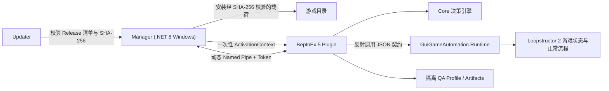

# 架构

## 设计目标

AutoPlayer 把“测试编排”和“游戏内执行”分开：Windows 管理器掌握安装、启动、profile、更新和报告；BepInEx 插件只在一次性授权的游戏进程中运行；决策引擎只根据结构化状态选择下一步动作。普通游戏启动不应获得自动化权限，也不应改变 BepInEx 创建的共享 Manager GameObject。

工具不携带游戏 DLL，也不修改 `Assembly-CSharp.dll`。插件通过反射发现打包游戏中已有的 `GuiGameAutomation.Runtime` 类型，因此游戏更新后可以先完成指纹和契约检查，再决定是否运行。



## 组件职责

| 组件 | 目标框架 | 职责 |
|---|---|---|
| `Loopstructor.AutoPlayer.Launcher` | .NET 8 Windows 自包含单文件 | 位于发布根目录，原样转发参数并启动内部 Manager 后立即退出 |
| `Loopstructor.AutoPlayer.Manager` | .NET 8 Windows 自包含，共享运行时 | 选择游戏、安装载荷、创建 QA profile、生成会话凭据、启动游戏、显示状态和发起更新；`manager\` 同时携带 Manager 与 Updater 共用的运行时 |
| `Loopstructor.AutoPlayer.Updater` | .NET 8 Windows，共享 Manager 运行时 | 在管理器退出后从临时副本校验并替换工具文件，避免运行中的文件被覆盖 |
| `Loopstructor.AutoPlayer.Core` | `netstandard2.0` | IPC 数据模型、协议版本、构建/会话标识和可单元测试的游玩决策 |
| `Loopstructor.AutoPlayer.Plugin` | `netstandard2.1` | BepInEx 生命周期、激活校验、兼容性检查、隔离补丁、Named Pipe 服务、证据采集 |
| `GuiGameAutomation.Runtime` | 游戏构建 | 暴露查询和动作命令；属于 Loopstructor2 源码与最终游戏构建，不属于本仓库发布物 |

## 启动与激活

1. 管理器定位游戏 EXE，并读取 `<Game>_Data\Managed\Assembly-CSharp.dll` 的 SHA-256。
2. 管理器在 `%LOCALAPPDATA%\LoopstructorAutoPlayer` 下创建本次 QA profile 与 artifact 目录。
3. 每次启动生成唯一 pipe 名称和新的高熵 token。token 长度必须在 32 到 256 字符之间。
4. 管理器通过子进程环境变量传递激活参数；无法可靠传递环境时，可写入绑定游戏根目录的单次启动票据。Manager 同时仅为这个子进程设置 Steam AppID `3841840`，避免 Steam `RestartAppIfNecessary` 改为启动库中另一份安装。
5. BepInEx 加载插件后，`ActivationContext` 验证协议、有效期、游戏根目录、pipe、token、允许的数据根目录和预期程序集哈希。验证失败或不存在激活上下文时立即返回，不保护共享 Manager GameObject，也不安装自动化补丁或开放 IPC。
6. 票据无论成功与否都在读取后删除；票据不得过期，也不得拥有超过 10 分钟的剩余有效期。
7. 只有激活验证成功后，插件才对 BepInEx Manager GameObject 调用 `DontDestroyOnLoad` 并设置 `HideAndDontSave`，让本次激活适配器隐藏且跨场景存活；该状态只属于当前 QA 进程。
8. 插件重新计算实际程序集指纹，检查产品身份和 `GuiGameAutomation.Runtime` 必需方法集合。
9. 插件先安装 QA 存档路径补丁，再通过运行中的 `SaveManager.GetSaveFolderPath` 验证实际路径确实位于本次 profile。只有 `SaveIsolationApplied` 与 `SaveIsolationVerified` 同时为 true 才算通过。
10. 插件安装四个必需的平台写入/重启补丁和游戏诊断产物重定向。四项平台补丁缺少任意一项都会使 `PlatformWritesBlocked = false`；产物重定向失败则 `GameArtifactsRedirected = false`。
11. 插件在 `hello` 中回传自身真实 PID、指纹、运行时契约和隔离状态；Manager 只在该 PID 仍存活且可执行文件路径等于所选测试包时接受握手，并用它替换最初的启动 PID。
12. Manager 同时要求 `SaveIsolationApplied`、`SaveIsolationVerified`、`PlatformWritesBlocked` 和 `GameArtifactsRedirected` 全部为 true。所有检查通过后才接受 `start`；否则保持 Standby/Incompatible/Faulted，不执行游戏动作。

支持的环境变量由共享协议定义：

```text
LOOPSTRUCTOR_AUTOPLAYER_ENABLED=1
LOOPSTRUCTOR_AUTOPLAYER_PIPE=<per-launch-name>
LOOPSTRUCTOR_AUTOPLAYER_TOKEN=<per-launch-secret>
LOOPSTRUCTOR_AUTOPLAYER_PROFILE_ROOT=<absolute-qa-profile-path>
LOOPSTRUCTOR_AUTOPLAYER_ARTIFACT_ROOT=<absolute-artifact-path>
LOOPSTRUCTOR_AUTOPLAYER_ASSEMBLY_SHA256=<64-lowercase-hex>
```

这些变量是管理器与子进程之间的实现协议，不是建议用户手工配置的永久设置。profile 必须位于 `DataRoot\profiles` 的子目录，artifact 必须位于 `DataRoot\artifacts` 的子目录。

`SteamAppId=3841840` 与 `SteamGameId=3841840` 也是进程级启动参数，但不属于自动化认证协议。它们只用于固定所选 QA 构建的 Steam 开发启动语义，不会写入游戏目录或永久环境。

## IPC 协议

IPC 使用本机 Named Pipe，每行一个 UTF-8 JSON 对象。pipe 名称和 token 每次启动变化；服务只允许一个连接。每个请求都应携带请求 ID 和本次会话 token：

```json
{"id":"request-1","token":"<session-token>","command":"status"}
```

基础命令如下：

| 命令 | 行为 |
|---|---|
| `ping` | 检查 pipe 与协议是否可用 |
| `status` | 返回状态、兼容性门禁、隔离状态和最近时间线 |
| `start` | 使用本次运行选项开始自动游玩 |
| `pause` | 在当前状态暂停决策，不终止游戏 |
| `resume` | 恢复决策循环 |
| `stop` | 回到待机状态，不再调用游戏动作 |

控制请求由 pipe 后台线程读取，改变 Unity 状态的命令排队到游戏主线程执行。请求在主线程未及时处理时返回超时，不能从 pipe 线程直接操作 Unity 对象。

## 游戏运行时契约

`RuntimeBridge` 不引用 `Assembly-CSharp.dll`，而是在已加载程序集里按完整类型名查找 `public static` 方法。当前契约覆盖：

- 前端、普通模式与随机模式选择；
- 当前可执行动作、奖励、事件、商店和弹窗；
- 默认防御、车辆、地图、子关卡、时间倍率和开波。

所有方法使用 JSON 字符串作为输入和结构化 JSON 作为输出。任何必需类型或方法缺失都会记录在握手状态中，整套自动化视为不兼容；不能只运行“碰巧还能找到”的部分命令。自动玩家不移动系统鼠标，也不发送系统键盘事件，因而不会抢占人工操作所依赖的全局输入；真实输入链路需要由独立黑盒测试覆盖。

## 决策循环

Core 中的 `DecisionEngine` 不直接访问 Unity。插件先查询状态，再将 JSON 状态和运行选项交给决策引擎，得到一个命令、参数、阶段和原因。主要阶段包括前端选择、初始化、防御准备、奖励、事件、商店、路线、开波、战斗、完成和恢复。

前端查询保持只读；任何前端写操作都要等 `Global.gm.isLoading == false`、当前 `sceneGm.isLoading == false`，并在下一轮轮询再次确认后才发出。这样不会在场景名已经切换、但模块与 UI 仍在初始化时模拟玩家点击。

新局通过普通或随机模式提交后才进入默认防线准备。若 `NewGameScene` 仍处于路线图，路线和子关卡选择优先于防线宏。无回路、无车列或没有已放置玩家车辆等干净的暂态失败可以继续轮询，不计入连续命令失败；`continueGame` 会关闭本次默认防线准备，保留隔离存档已有的轨道、车列和站点布局。

默认防线命令可能返回嵌套的子命令结果。结果检查器会递归查找任意深度的 `statePolluted = true` 或 `needsReset = true`，并识别“动力站点已经提交、后续步骤却失败”的错误包装；发现后立即升级为 Unsafe/Faulted，并要求新游戏进程，不能在同一进程重试宏来掩盖污染。

路线阶段只从 `canPlayerSelect = true` 的节点中选择，空候选不能退化为 `readyIndex = 0`。`selectMapNode` 返回成功后还必须观察到已提交的 `chooseNode` 或 `pendingSubLevelNode`；没有状态变化的成功响应仍按失败处理，避免每个 Tick 重复选择同一节点。

插件按固定间隔执行一次决策，并具备以下停止条件：

- 连续命令失败达到上限；
- 非战斗阶段长时间没有可验证进展；
- 运行时契约或隔离条件失效；
- 游戏报告完成或管理器发送停止命令。

故障时记录最终状态、原因和截图，避免静默无限循环。

## 数据与隔离

```text
%LOCALAPPDATA%\LoopstructorAutoPlayer\
  profiles\<qa-profile-id>\       独立测试存档
  artifacts\<run-id>\             状态、时间线、日志、失败截图
  tickets\launch-<root-id>.json    单次启动票据，消费后删除
```

存档重定向通过 Harmony 在当前进程内拦截 `ActFramework_ByHZR.Save.SavePathUtility.GetCompanyAppDataPath` 及其内部实现。补丁安装只是第一阶段；第二阶段必须反射调用 `SaveManager.GetSaveFolderPath`，并对规范化后的实际路径做 profile 包含检查。握手成功前不发送任何游戏命令，验证失败或超时直接进入 Faulted。

平台隔离目前精确覆盖四个入口：

```text
ActFramework_ByHZR.Achievements.Unit.SteamAchievementController.UnlockAchievement
ActFramework_ByHZR.MainLoop.Version.PlatformAchievementBridge.ReportIGPAchievement
MetroTD.UISystem.SettlementDataTotalManager.TryAutoSendResultOnce
Steamworks.SteamAPI.RestartAppIfNecessary
```

四个入口全部补丁成功才设置 `PlatformWritesBlocked = true`。结算 JSON、对象池 CSV 和游戏调试日志则被重定向到本次 artifact；该重定向也属于强制门禁。所有 Harmony 补丁只改变当前进程的方法路径，不写回 `Assembly-CSharp.dll`，游戏退出后自然消失。

该门禁不等同于零平台痕迹：Steam 在线状态、时长、Overlay、客户端启动记录和未覆盖的第三方 SDK 行为仍可能留下记录。需要零痕迹时应使用无平台 SDK 的测试包；否则至少使用离线环境与专用测试账号。进程级 AppID 不伪造许可，也不绕过 `SteamAPI_Init`；本机或账号对 AppID `3841840` 的许可失败会阻断依赖 Steam API 的验证，但本次隔离玩法回归仍可运行。

## 已知运行观察

- 普通模式与随机模式均已完成跨波真实包验证。随机转盘离场后，游戏仍会记录 `RandomMode_TurnTableManager.StopDecorateAnimation` 延迟回调中的非致命 `Animator.Play` 空引用；自动化不会吞掉该异常。
- 当前本机/账号对 Steam AppID `3841840` 的许可校验失败。涉及 Steam 初始化的结果必须在有许可的 QA 环境或无平台测试包中复验，自动化工具不会绕过该校验。

## 发布包结构

唯一的 Release ZIP `Loopstructor.AutoPlayer-0.1.9-win-x64.zip` 同时用于手动下载和新版自动更新。它必须完整解压，不能直接在资源管理器的 ZIP 预览中运行；压缩包只有一个固定顶层目录，进入该目录后才是程序根目录：

```text
Loopstructor 2.AutoPlayer/
  Loopstructor.AutoPlayer.Manager.exe  用户启动的根目录单文件入口
  manager/
    Loopstructor.AutoPlayer.Manager.exe  管理器入口
    Loopstructor.AutoPlayer.Updater.exe  更新器入口
    System.Windows.Forms.dll       两个入口共用的自包含运行时文件
  updater/
    Loopstructor.AutoPlayer.Updater.dll  旧版包结构兼容标记
  payload/
    bepinex/                       BepInEx 5.4.23.5 完整 Windows x64 运行时
    plugin/                        AutoPlayer Plugin/Core 及运行依赖
  autoplayer-release.json          安装根安全标记
  version.json                     版本兼容信息
  checksums.sha256                 包内逐文件 SHA-256
```

schema 2 更新清单指向同一个 Release ZIP。新版 Updater 验证压缩包只有名称和大小写精确为 `Loopstructor 2.AutoPlayer/` 的顶层目录，安全移除该包装层后再验证并事务替换程序根。由于 schema 和归档结构都已改变，`v0.1.2` 不能自动升级到 `v0.1.3`，用户必须手动下载并解压一次；完成迁移后，后续新版可以使用同一结构自动更新。

从 `v0.1.4` 起，公开仓库且未提供 token 时，Updater 通过 GitHub 网页端 `releases/latest` 解析同一仓库的精确 tag，再从该 tag 的 Release 资产地址下载清单和 ZIP；它不调用匿名 REST API，因此不受每个出口 IP 每小时 60 次的匿名 API 配额影响。提供 token（包括私有仓库）时才使用 GitHub REST API 返回的资产 URL；token 只发送给 `api.github.com`，重定向到 Release CDN 后不转发。两种路径都将清单和 ZIP 固定到同一精确 tag，并校验 tag、清单版本、资产名、大小及 SHA-256。

`v0.1.3` 的无 token 更新仍可能因匿名 REST API 配额耗尽而返回 403。遇到该情况时需等待配额恢复、在当前 Manager 进程环境中临时提供只读 token，或手动安装 `v0.1.4` 一次；之后公开仓库的无 token 更新即使用新的网页 Release 路径。

根启动器只负责原样转发参数并启动 `manager\Loopstructor.AutoPlayer.Manager.exe`，随后立即退出；用户无需进入内部 `manager\` 目录。根启动器是自包含单文件，内部 Manager 和 Updater 都位于 `manager\`，并只携带一套共用的 .NET/WinForms 运行时；`updater\` 只保留供旧版包结构校验使用的小型程序集，不重复携带运行时。完整解压后运行根部 EXE 仍无需安装系统 .NET。固定的 `Loopstructor 2.AutoPlayer\` 目录无需随版本重命名。Manager 打开后，标题区会永久显示 `AutoPlayer 版本 v<当前版本>`，不依赖选择或加载游戏目录，更新检查状态也不会覆盖该版本文本；实际版本同时记录在 `autoplayer-release.json`。GitHub Actions artifact 仍保持扁平；平台提供的外层 ZIP 打开后直接是程序文件和根部 Manager EXE，不包含 `Loopstructor 2.AutoPlayer\` 包装目录或第二层产品 ZIP。游戏文件和 `Assembly-CSharp.dll` 不在该目录树中。
